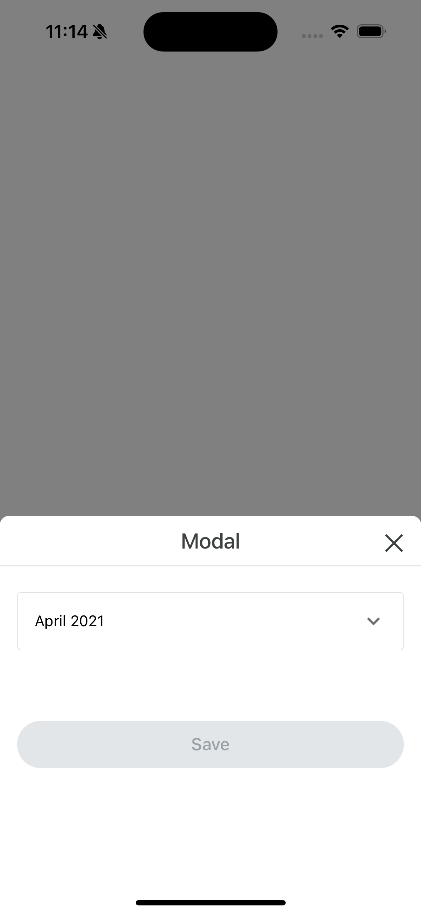

# react-native-year-month-picker-select

A simple and flexible Year/Month picker & select component for React Native.




## Features
- Easy-to-use UI for selecting year and month
- Supports both iOS and Android
- Flexible API: customizable icons, labels, error display, etc.
- No theme or project dependencies

## Installation

```
npm install react-native-year-month-picker-select @react-native-picker/picker
```

## Usage

```tsx
import { YearMonthPickerSelect } from 'react-native-year-month-picker-select';

const customMonths = [
  { label: 'Jan', value: 1 },
  { label: 'Feb', value: 2 },
  { label: 'Mar', value: 3 },
  { label: 'Apr', value: 4 },
  { label: 'May', value: 5 },
  { label: 'Jun', value: 6 },
  { label: 'Jul', value: 7 },
  { label: 'Aug', value: 8 },
  { label: 'Sep', value: 9 },
  { label: 'Oct', value: 10 },
  { label: 'Nov', value: 11 },
  { label: 'Dec', value: 12 },
];

<YearMonthPickerSelect
  value={value} // { year: 2024, month: 6 }
  onChange={(v) => setValue(v)}
  placeholder="Select year and month"
  label="Year/Month"
  required
  errorMessage={error}
  startYear={2000}
  endYear={2030}
  yearUnit="Year"
  months={customMonths}
  yearMonthOrder="year-month" // or "month-year"
/>
```

### YearMonthPickerSelect Props
| Name | Type | Description |
|---|---|---|
| value | `{ year: number, month: number }` | Selected year and month |
| onChange | `(value) => void` | Callback when year/month is selected |
| placeholder | `string` | Placeholder text |
| label | `string` | Label text |
| helperText | `string` | Helper text below input |
| errorMessage | `string` | Error message text |
| disabled | `boolean` | Disable input |
| required | `boolean` | Show required mark |
| startYear | `number` | Start year for selection |
| endYear | `number` | End year for selection |
| yearUnit | `string` | Suffix for year (e.g. "Year") |
| months | `{ label: string; value: number }[]` | Custom month list (e.g. English, Japanese, etc.) |
| yearMonthOrder | `'year-month' | 'month-year'` | Order of year/month pickers (default: 'year-month') |
| icon | `ReactNode` | Icon on the left |
| iconRight | `ReactNode` | Icon on the right |
| iconPosition | `'left' | 'right' | 'top' | 'bottom'` | Icon position |
| testID | `string` | Test ID |
| style | `ViewStyle` | Root view style |
| inputStyle | `TextStyle` | Input style |
| labelStyle | `TextStyle` | Label style |
| errorStyle | `TextStyle` | Error style |
| containerStyle | `ViewStyle` | Container style |
| pickerProps | `Partial<YearMonthPickerProps>` | Additional props for modal picker |

### YearMonthPicker Props
| Name | Type | Description |
|---|---|---|
| visible | `boolean` | Modal visibility |
| value | `{ year: number, month: number }` | Selected year and month |
| onClose | `() => void` | Callback when modal is closed |
| onConfirm | `(value) => void` | Callback when year/month is confirmed |
| startYear | `number` | Start year for selection |
| endYear | `number` | End year for selection |
| yearUnit | `string` | Suffix for year |
| months | `{ label: string; value: number }[]` | Custom month list |
| yearMonthOrder | `'year-month' | 'month-year'` | Order of year/month pickers (default: 'year-month') |
| title | `string` | Modal title |
| order | `'asc' | 'desc'` | Year order |

## License
MIT 